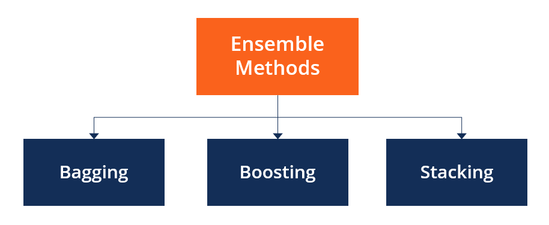

# Summary of Ensemble learning
-   Ensemble methods aim at improving predictability in models by combining several models to make one very reliable model.
-   The most popular ensemble methods are boosting, bagging, and stacking.
-   Ensemble methods are ideal for regression and classification, where they reduce bias and variance to boost the accuracy of models.

# Main different of three popular ensemble methods (Bagging, Boosting, Stacking)
## Bagging

There are three steps:
-   Sample equal-sized subsets with replacement
-   Train weak models on each of the subsets independently and in parallel
-   Combine the results from each of the weak models by averaging or voting to get a final result

## Boosting
-   During training, instances that are classified incorrectly are assigned higher weights to give some form of priority when trained with the next model:

-   Additionally, weaker models are assigned lower weights than strong models when combining their predictions into the final output.

-   So, we first initialize data weights to the same value and then perform the following steps iteratively:

    -   Train a model on all instances
    -   Calculate the error on model output over all instances
    -   Assign a weight to the model (high for good performance and vice-versa)
    -   Update data weights: give higher weights to samples with high errors
    -   Repeat the previous steps if the performance isn’t satisfactory or other stopping conditions are met
-   Finally, we combine the models into the one that we use for prediction.

## Stacking
-   In stacking, the predictions of base models are fed as input to a meta-model (or meta-learner). The job of the meta-model is to take the predictions of the base models and make a final prediction:
  

-   The base and meta-models don’t have to be of the same type
-   Here are the steps:
    -   Construct base models on different portions of the training data
    -   Train a meta-model on the predictions from the base models